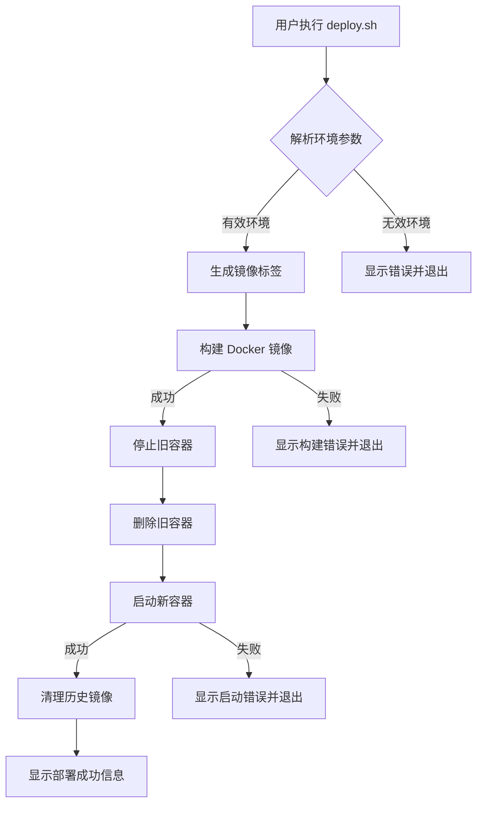

# Design Document

## Overview

本设计文档描述了基于 Podman 的多环境一键部署方案。方案包含一个 Dockerfile 用于构建 NestJS 应用镜像，以及一个 Shell 脚本实现构建、部署、清理的自动化流程。

## Architecture



## Components and Interfaces

### 1. Dockerfile

多阶段构建的 Dockerfile，用于构建优化的 NestJS 应用镜像。

```dockerfile
# 阶段1: 构建阶段
FROM node:24-alpine AS builder
WORKDIR /app
COPY package.json pnpm-lock.yaml ./
RUN npm install -g pnpm && pnpm install --frozen-lockfile
COPY . .
RUN pnpm build

# 阶段2: 生产阶段
FROM node:24-alpine AS production
WORKDIR /app
COPY --from=builder /app/dist ./dist
COPY --from=builder /app/node_modules ./node_modules
COPY --from=builder /app/package.json ./
CMD ["node", "dist/main.js"]
```

### 2. Deploy Script (deploy.sh)

Shell 脚本，提供以下函数：

| 函数名               | 功能               | 参数                                |
| -------------------- | ------------------ | ----------------------------------- |
| `parse_args()`       | 解析命令行参数     | `$@`                                |
| `validate_env()`     | 验证环境参数有效性 | `$ENV`                              |
| `generate_tag()`     | 生成镜像标签       | `$PROJECT_NAME, $ENV`               |
| `build_image()`      | 构建容器镜像       | `$TAG`                              |
| `stop_container()`   | 停止运行中的容器   | `$CONTAINER_NAME`                   |
| `remove_container()` | 删除容器           | `$CONTAINER_NAME`                   |
| `start_container()`  | 启动新容器         | `$TAG, $ENV`                        |
| `cleanup_images()`   | 清理历史镜像       | `$PROJECT_NAME, $ENV, $CURRENT_TAG` |
| `print_status()`     | 打印状态信息       | `$MESSAGE, $TYPE`                   |

### 3. 环境配置映射

| 环境        | 端口 | 环境文件         |
| ----------- | ---- | ---------------- |
| development | 3000 | .env.development |
| test        | 3001 | .env.test        |
| production  | 9000 | .env.production  |

## Data Models

### 镜像标签格式

```
{PROJECT_NAME}-{ENV}-{TIMESTAMP}
```

示例：`storeverserepo-serve-production-20241230143022`

### 容器命名格式

```
{PROJECT_NAME}-{ENV}
```

示例：`storeverserepo-serve-production`

### 脚本配置变量

```bash
PROJECT_NAME="storeverserepo-serve"
VALID_ENVS=("development" "test" "production")
PORT_MAP=(
  ["development"]=3000
  ["test"]=3001
  ["production"]=9000
)
```

## Correctness Properties

_A property is a characteristic or behavior that should hold true across all valid executions of a system-essentially, a formal statement about what the system should do. Properties serve as the bridge between human-readable specifications and machine-verifiable correctness guarantees._

### Property 1: 环境参数验证

_For any_ 输入的环境参数，如果不在 `[development, test, production]` 列表中，脚本应该返回非零退出码并显示错误信息。

**Validates: Requirements 1.4**

### Property 2: 镜像标签唯一性

_For any_ 两次不同时间的构建，生成的镜像标签应该不同（因为包含时间戳）。

**Validates: Requirements 2.2**

### Property 3: 容器单实例

_For any_ 给定环境，在部署完成后，应该只有一个该环境的容器在运行。

**Validates: Requirements 3.1, 3.2**

### Property 4: 历史镜像清理

_For any_ 部署完成后，同环境的历史镜像数量应该为 0（只保留最新的）。

**Validates: Requirements 4.1, 4.2**

## Error Handling

| 错误场景      | 处理方式               | 退出码 |
| ------------- | ---------------------- | ------ |
| 无效环境参数  | 显示有效环境列表并退出 | 1      |
| Podman 未安装 | 提示安装 Podman 并退出 | 1      |
| 镜像构建失败  | 显示构建日志并退出     | 1      |
| 容器启动失败  | 显示错误信息并退出     | 1      |
| 端口被占用    | 提示端口冲突并退出     | 1      |

## Testing Strategy

### 单元测试

由于是 Shell 脚本，测试主要通过手动验证：

1. 测试无效环境参数处理
2. 测试默认环境参数
3. 测试镜像标签生成格式
4. 测试各环境端口映射

### 集成测试

1. 完整部署流程测试（development 环境）
2. 环境切换测试
3. 历史镜像清理验证
4. 容器重启测试

### 属性测试

由于 Shell 脚本的特性，属性测试通过脚本内置的验证逻辑实现：

- 环境参数验证函数确保只接受有效值
- 镜像标签生成函数确保格式正确
- 清理函数确保只删除历史镜像
